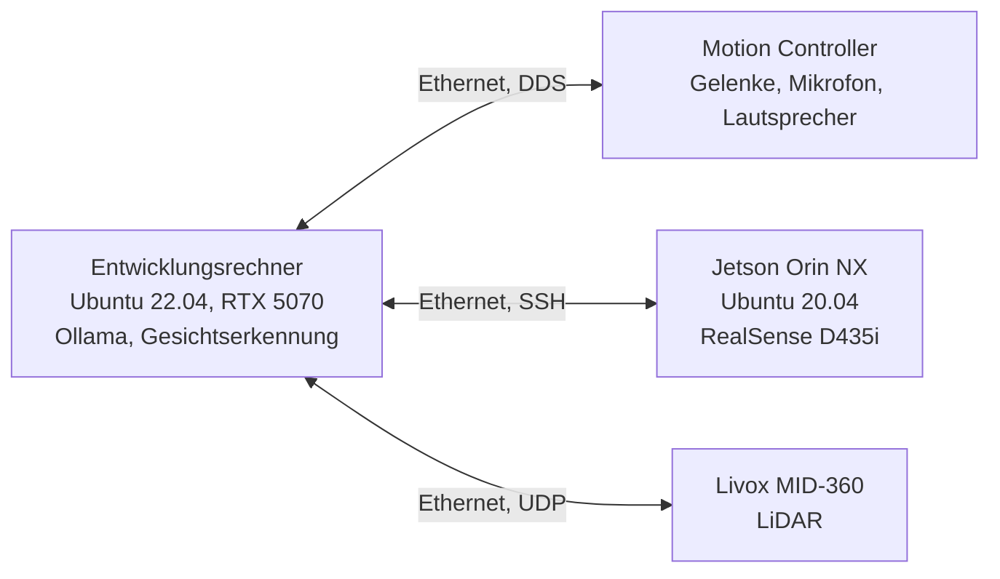

# Unitree G1 EDU: Inbetriebnahme, Systemintegration und Sprachdialog

Eigenes Projekt zur Inbetriebnahme und Integration eines humanoiden Roboters Unitree G1 EDU (23 DoF), Spitzname „Robby“. Ziel ist ein sprachgesteuerter, sensorbewusster Roboter, der Personen erkennt, mit ihnen spricht und Gesten ausführt – mit sauber dokumentierten Schnittstellen und nachvollziehbaren Messungen.

## Überblick

| Bereich | Umsetzung |
|---|---|
| Netzwerk und Kommunikation | CycloneDDS über `unitree_sdk2` (C++), ohne ROS-2-Zwischenschicht |
| Schnittstellenverzeichnis | 128 DDS-Topics im Stil einer DBC-Datei dokumentiert, dazu alle Nicht-DDS-Wege |
| Sprachdialog | erkannter Text vom Roboter, lokales Sprachmodell, Sprachausgabe und Armgesten |
| Gesichtserkennung | Erkennung und Wiedererkennung mit Einwilligung, Begrüßung mit Namen |
| Personenprofile | SQLite, geladen nur für die bestätigte Person im Bild |
| LiDAR | Livox MID-360 direkt am Entwicklungsrechner, Einbaulage per IMU korrigiert |

## Systemarchitektur

Alle Rechner liegen im internen Roboternetz und sind über Ethernet verbunden. DDS braucht eine direkte Verbindung im selben Netzsegment; über ein geroutetes WLAN findet der Entwicklungsrechner den Motion Controller nicht.

## Sprachdialog

1. Der Roboter erkennt gesprochene Sprache an Bord und sendet den Text per DDS.
2. Ein C++-Programm schickt den Text mit Kontext an ein lokales Sprachmodell (Ollama, qwen3.5:9b).
3. Die Antwort geht als Sprachausgabe an den Roboter, passende Armgesten laufen über den Arm-Dienst des SDK.
4. Unterbrechungen werden erkannt, sodass der Roboter mitten im Satz aufhört, wenn jemand spricht.

Zusatzfunktionen: Begrüßung erkannter Personen mit Namen, Geburtstagsablauf und vorbereitete „Shows“ mit Sprache, Gesten und Tanz. Die gemessene Reaktionszeit vom Ende der Frage bis zum Beginn der Antwort liegt bei 2,4 bis 2,7 Sekunden.

Wichtig für das Verständnis: Das Sprachmodell erzeugt nur Text. Ob daraus eine Bewegung wird, entscheidet feste Logik im C++-Programm, nicht das Modell.

## Gesichtserkennung mit Einwilligung

- Erkennung und Wiedererkennung mit YuNet und SFace (OpenCV), Kamerabild über WLAN.
- Neue Personen werden nur nach ausdrücklicher Zustimmung angelernt („Kennenlernen“).
- Profile mit Name, Interessen und Notizen liegen lokal in SQLite und werden nur für die eine bestätigte Person im Bild geladen.
- Keine Gesichtsdaten oder Profile in diesem Repository.

## Messen statt vermuten: Beispiele

- **LiDAR falsch herum eingebaut:** Die Punktwolke wirkte plausibel. Erst die IMU-Daten des Sensors zeigten die Einbaulage. Korrigiert über eine Rollkorrektur in der Treiberkonfiguration.
- **LiDAR-Rate:** Direkt am Entwicklungsrechner 10 Hz statt rund 3 Hz über den Umweg Motion Controller.
- **Kamera am Jetson:** Ein lange vermuteter Kamerafehler war am Ende eine Steckverbindung, gefunden erst durch Nachsehen am Gerät.
- **Vergleichbare Messungen:** Messwerte sind nur vergleichbar, wenn Betriebsmodus und Systemzustand gleich sind, etwa Dämpfungsmodus gegen aktiv oder frisch gestartet gegen lange laufend.

## Dokumentation

Zu jedem Thema gibt es ein eigenes technisches Dokument, darunter Inbetriebnahme, Netzwerk und Sensordaten, Kameraanbindung, LiDAR-Direktzugriff, Sprachdialog und Gesichtswiedererkennung. Das Signalverzeichnis trennt gemessene von vermuteten Angaben.

## Werkzeuge

C++ · Python · Unitree SDK2 · CycloneDDS · Linux (Ubuntu) · NVIDIA Jetson · Ollama · OpenCV · SQLite · Foxglove Studio · Livox SDK2

