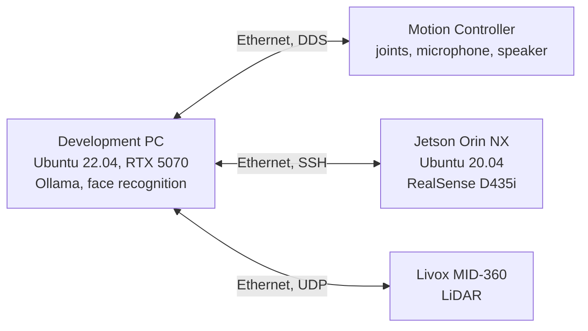
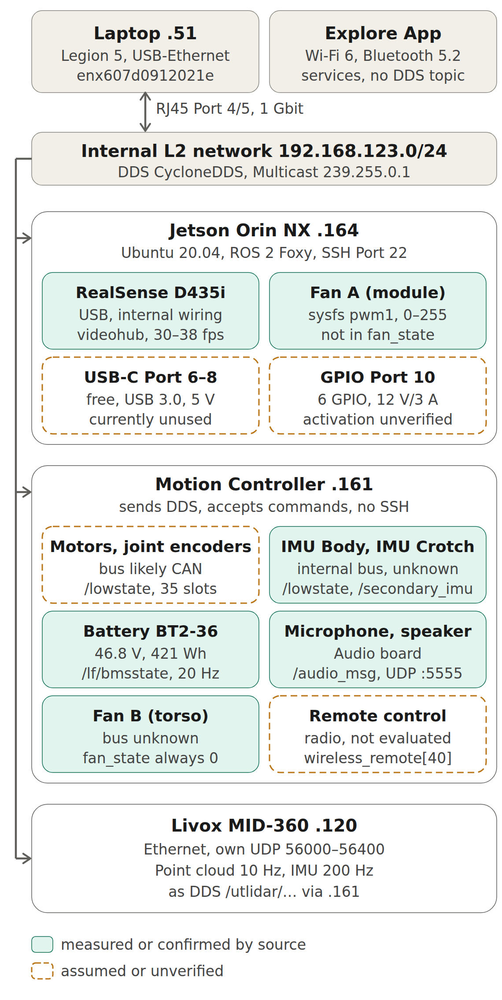

# Unitree G1 EDU: Commissioning, System Integration and Voice Dialogue

Personal project on commissioning and integrating a Unitree G1 EDU humanoid robot (23 DoF), nicknamed "Robby". The goal is a voice-controlled, sensor-aware robot that recognizes people, talks to them and performs gestures – with cleanly documented interfaces and traceable measurements.

## Overview

| Area | Implementation |
|---|---|
| Network and communication | CycloneDDS via `unitree_sdk2` (C++), without a ROS 2 layer |
| Interface registry | 128 DDS topics documented in the style of a DBC file, plus all non-DDS paths |
| Voice dialogue | Recognized text from the robot, local language model, speech output and arm gestures |
| Face recognition | Detection and re-identification with consent, greeting by name |
| Personal profiles | SQLite, loaded only for the confirmed person in the image |
| LiDAR | Livox MID-360 connected directly to the development PC, mounting orientation corrected via IMU |

## System Architecture

Detailed view with all components, connection types and DDS topics:

All computers are on the robot's internal network and connected via Ethernet. DDS requires a direct connection within the same network segment; over a routed Wi-Fi network, the development PC cannot discover the Motion Controller.

## Voice Dialogue

1. The robot recognizes spoken language on board and sends the text via DDS.
2. A C++ program sends the text with context to a local language model (Ollama, qwen3.5:9b).
3. The response is sent to the robot as speech output; matching arm gestures run via the SDK's arm service.
4. Interruptions are detected, so the robot stops mid-sentence when someone speaks.

Additional features: greeting recognized people by name, a birthday routine and prepared "shows" combining speech, gestures and dance. The measured response time from the end of a question to the start of the answer is 2.4 to 2.7 seconds.

Key design point: the language model only produces text. Whether a movement follows is decided by fixed logic in the C++ program, not by the model.

## Consent-Based Face Recognition

- Detection and re-identification with YuNet and SFace (OpenCV), camera image via Wi-Fi.
- New people are only enrolled after explicit consent ("getting to know you" flow).
- Profiles with name, interests and notes are stored locally in SQLite and loaded only for the one confirmed person in the image.
- No face data or profiles are stored in this repository.

## Measure, Don't Assume: Examples

- **LiDAR mounted upside down:** The point cloud looked plausible. Only the sensor's IMU data revealed the mounting orientation. Corrected with a roll correction in the driver configuration.
- **LiDAR rate:** 10 Hz directly at the development PC instead of about 3 Hz via the Motion Controller.
- **Jetson camera:** A long-suspected camera fault turned out to be a connector, found only by checking the hardware.
- **Comparable measurements:** Values are only comparable if operating mode and system state are the same, e.g. damping mode vs. active, or freshly started vs. long-running.

## Documentation

Each topic has its own technical document, including commissioning, network and sensor data, camera integration, direct LiDAR access, voice dialogue and face re-identification. The signal registry separates measured from assumed information.

## Contents of this folder

| File | Content |
|---|---|
| [docs/G1_architecture.png](docs/G1_architecture.png) | Hardware and communication paths |
| [docs/signal_registry_excerpt.md](docs/signal_registry_excerpt.md) | Verified DDS topics with measured rates |
| [docs/commissioning_checklist.md](docs/commissioning_checklist.md) | Connecting the development PC, CycloneDDS setup, lessons learned |
| [examples/read_state.cpp](examples/read_state.cpp) | Read-only example: IMU and arm joint values |
| [examples/cyclonedds_g1.xml](examples/cyclonedds_g1.xml) | CycloneDDS configuration |

## Tools

C++ · Python · Unitree SDK2 · CycloneDDS · Linux (Ubuntu) · NVIDIA Jetson · Ollama · OpenCV · SQLite · Foxglove Studio · Livox SDK2
